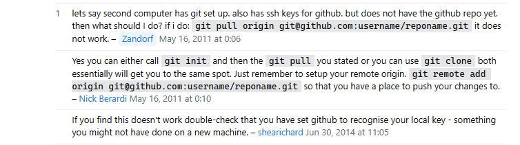

If your are reading this then this means you want to code from to different devices

YouTube LINK --->  https://www.youtube.com/watch?v=FkxdgjxeNek&ab_channel=ErikDubois 

(This guy used a command line but you dont need too.)

One way of doing it:
go to github get get the clone link then go to github desktop. File > clone repo > URL then paste repo in url text box and press clone.

Another way:
YouTube LINK --->  https://www.youtube.com/watch?v=0Bj-jTkhlTw&ab_channel=Iknowpython

Somemore information

